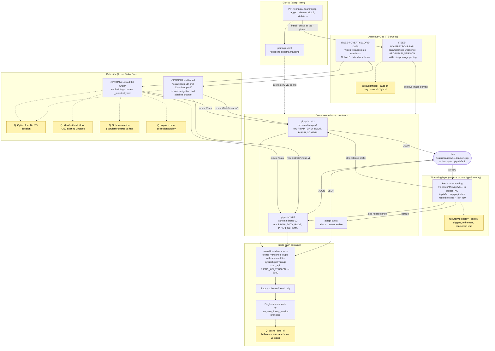

# PIP API Code-Data Versioning — Meeting Brief for ITS

**Purpose.** Prepare a shared reference for tomorrow's meeting with ITS on the design of a code–data versioning feature for the PIP API. This document summarises **where things stand today** and **what is being proposed**, in two parallel sections: current architecture and proposed new architecture, each with a written description and a Mermaid diagram. Open questions are collected at the end.

**Sources.** All claims below are grounded in two internal brainstorming notes:
- `.cg-docs/brainstorms/2026-08-28-pipapi-code-data-versioning-model.md` (code–data coupling, schema contracts, code pinning, historical pairings)
- `.cg-docs/brainstorms/2026-09-03-pipapi-multi-version-api-routing.md` (multi-version concurrent serving, routing, storage strategy)

**Glossary (used throughout).**
- *Vintage folder* — one dated snapshot of PIP data on disk (e.g., `20250601_2025_01_02_PROD`). Encodes release date, PPP year, version identifiers, and environment tag (`PROD`/`INT`/`TEST`).
- *Schema family* — the structural shape of the data files a vintage provides. Today there are two: **lineup-v1** (pre-May 2025) and **lineup-v2** (post-May 2025). These are not just different filenames — they use different algorithms, different lookup tables, and different distribution-statistics granularity.
- *Release* — a specific pinned pipapi package version (a git tag / SHA). A release "supports" one schema family (after the proposed change).
- *Pairing* — the coupling of one pipapi release with one schema family (and therefore with a set of vintage folders).
- *Manifest* (`_manifest.yaml`) — a small YAML file placed inside each vintage folder declaring its schema.
- *ITSES-POVERTYSCOREAPI* — the Azure DevOps repo that ITS owns for deploying the API (Dockerfile, main.R, pipelines).
- *ITSES-POVERTYSCORE-DATA* — the Azure DevOps data pipeline that produces vintage folders and drops them into shared storage.

---

## 1. Current Architecture

### 1.1 Written description

#### Data side

- Vintage folders are produced by the ITSES-POVERTYSCORE-DATA pipeline and dropped into a single shared storage area (Azure Blob / Azure File) exposed to the API container as `/Data`.
- The layout is **flat**: all vintages, regardless of schema family, live side-by-side under `/Data/` (roughly ~200 folders today, growing).
- Vintage folders **do not carry a manifest**. The only thing that identifies which schema they belong to is the release-date prefix in the folder name.
- Schema family is currently *inferred* by the R code from the date prefix, using a hard-coded cutoff of **May 1, 2025**: earlier → lineup-v1, later → lineup-v2. This is the function `use_new_lineup_version()` in `R/create_lkups.R:989-1001`.
- Everything is mutable in place: if a vintage's data is corrected, there is no formal versioning of the correction.

#### Code side

- The `pipapi` R package (a plumber API) is the main artifact.
- At startup, `create_versioned_lkups(data_dir = "/Data")` scans every folder under `/Data`, calls `create_lkups()` on each, and merges everything into one global `lkups` object held in memory. This object contains lookup tables and computed metadata for every vintage.
- Inside `create_lkups()`, the date heuristic (`use_new_lineup_version()`) picks between two parallel code paths:
  - **Lineup-v1 path**: reads raw survey `.fst` files, uses `ref_lkup`, and runs a loop-based FGT algorithm.
  - **Lineup-v2 path**: reads pre-processed `.fst` with cumulative columns (`cw`, `cwy`, `cwy2`, `cwylog`), uses `refy_lkup`, and runs a cumsum-based algorithm with `findInterval`.
- Result: ~230 lines of conditional logic and two parallel implementation stacks (`pip_old_lineups.R` and `pip_new_lineups.R`) live in the same code base.
- Per-request logic: the `validate_version` plumber filter (`R/endpoints.R:91-130`) picks a vintage from the loaded `lkups` based on query parameters (`?version=`, `release_version`, `ppp_version`, `identity`), defaulting to `lkups$latest_release` when nothing is specified.
- The package version in `DESCRIPTION` (~1.5.6) is standard semver, but it is **not tied to any deployment** — the deployment always installs whatever is on the `@DEV` branch (see below).

#### API deployment side (the section most relevant to ITS)

This is the piece that is least understood by the pipapi team and most owned by ITS. Based on the brainstorms:

- **Repository.** ITS owns an Azure DevOps repo called **`ITSES-POVERTYSCOREAPI`**. It has three branches — `DEV`, `QA`, `PROD` — which represent environment promotion, **not** version pinning of the pipapi code.
- **Dockerfile.** `PIP_CustomImage/Dockerfile` in that repo installs pipapi with:
  ```dockerfile
  RUN R -e "remotes::install_github('PIP-Technical-Team/pipapi@DEV')"
  ```
  This is a **floating branch reference**: whatever is currently on the `DEV` branch of the pipapi GitHub repo is what ends up baked into the image. There is no tag or SHA pin.
- **Startup script.** `R/main.R` (inside the container) does essentially two things:
  1. `create_versioned_lkups("/Data")` — load all vintages into memory.
  2. `start_api("v1", 8080)` — source `inst/plumber/v1/plumber.R`, mount the routes with the hard-coded `/api/v1/` prefix, and listen on port 8080.
- **Container.** There is **one live container** running at any time. That container serves the entire API. Route decorators like `@get /api/v1/pip` are literal strings — a single plumber process cannot serve two different pipapi package versions at the same time.
- **Data mount.** The `/Data` path inside the container is a mount onto the shared Azure Blob/File area where the ITSES-POVERTYSCORE-DATA pipeline drops vintages. All vintages accumulate here.
- **Pipeline.** The ITSES-POVERTYSCORE-DATA pipeline is a separate Azure DevOps pipeline that writes new vintages into `/Data`. It has no schema-awareness today.
- **Exposure.** The container is exposed to consumers via a single base URL that serves `/api/v1/*`. The exact routing layer in front (App Service, Application Gateway, reverse proxy) is not detailed in the brainstorms, but it is a single upstream pointing at the single container.

#### User-facing side

- Users call endpoints under a single base URL of the form `<host>/api/v1/<endpoint>` (for example `/api/v1/pip`).
- To select a specific vintage of the data, they pass query parameters: `?version=`, `?release_version=`, `?ppp_version=`, or `?identity=`. If they pass nothing, they get `lkups$latest_release` — the most recent vintage loaded at startup.
- There is **no way for a user to ask for a specific code version** of the API. "Version X" today means old *data* loaded by whatever code happens to be on `@DEV`. Historical reproducibility of an old code + old data combination is not available.

#### End-to-end interaction

1. ITSES-POVERTYSCORE-DATA pipeline writes a new vintage folder into shared Azure Blob/File `/Data`.
2. The `ITSES-POVERTYSCOREAPI` pipeline builds a Docker image. The Dockerfile installs `pipapi@DEV` from GitHub.
3. The container starts. `main.R` calls `create_versioned_lkups("/Data")`, which scans all folders, classifies each by the May-2025 date heuristic, and loads them all into a global `lkups`. One structurally incompatible folder can crash the whole startup.
4. `start_api("v1", 8080)` mounts the plumber routes with the fixed `/api/v1/` prefix.
5. A user calls `<host>/api/v1/pip?version=...`. The plumber filter resolves the vintage against `lkups`, the request runs on whichever code path (v1 or v2) the vintage's date heuristic selected, and the response is returned with `Cache-Control` headers.

### 1.2 Current architecture — Mermaid diagram

```mermaid
flowchart LR
    subgraph Data["Data side (Azure Blob / File)"]
        DATA["/Data (flat, ~200 vintages)<br/>20240315_..._PROD<br/>20250601_..._PROD<br/>... (no manifests)"]
    end

    subgraph Pipelines["Azure DevOps pipelines (ITS-owned)"]
        DP["ITSES-POVERTYSCORE-DATA<br/>(data pipeline)"]
        AP["ITSES-POVERTYSCOREAPI<br/>Dockerfile + main.R<br/>branches: DEV / QA / PROD"]
    end

    subgraph GitHub["GitHub (pipapi team)"]
        REPO["PIP-Technical-Team/pipapi<br/>branch: @DEV (floating)"]
    end

    subgraph Container["Single live API container"]
        MAIN["main.R<br/>create_versioned_lkups('/Data')<br/>start_api('v1', 8080)"]
        LKUPS["Global lkups object<br/>(all vintages, both schemas)"]
        CODE["pipapi code<br/>use_new_lineup_version() branches<br/>lineup-v1 path + lineup-v2 path"]
        PLUMBER["Plumber routes<br/>hard-coded /api/v1/*"]
    end

    USER(["User<br/>&lt;host&gt;/api/v1/pip?version=..."])

    DP -->|writes new vintage folders| DATA
    REPO -.->|install_github @DEV<br/>floating, unpinned| AP
    AP -->|builds & deploys image| Container
    DATA ===|mounted as /Data| MAIN
    MAIN --> LKUPS
    LKUPS --> CODE
    CODE --> PLUMBER
    USER -->|HTTPS| PLUMBER
    PLUMBER -->|JSON + Cache-Control| USER

    classDef problem fill:#fde0e0,stroke:#c00,color:#000
    class REPO,DATA,CODE problem
```



Red-tinted nodes highlight the three coupling weaknesses named in the brainstorms: unpinned code, unlabelled data, and conditional dual-schema code paths.

---

## 2. Proposed New Architecture

The proposal is a **phased design** combining the two brainstorms. Phase 1 introduces the schema contract; Phase 2 pins the code and formalises pairings; Phase 3/subsequent phases (from the second brainstorm) add concurrent multi-release routing so users can address historical pairings by URL.

### 2.1 Written description

#### Data side

- Each vintage folder gains a small **`_manifest.yaml`** at its root, declaring the schema family and required contents. Example:
  ```yaml
  release_date: 2025-06-01
  schema_id: lineup-v2
  ppp_year: 2025
  required_files:
    - estimations/prod_refy_estimation.fst
    - estimations/lineup_years.fst
    - lineup_data/
  ```
- Two storage layouts are on the table (**this is a key ITS decision**):
  - **Option A — Shared flat storage.** `/Data/` stays flat exactly as today; classification is done by reading each vintage's manifest at container startup. No data migration. Recommended as the starting point.
  - **Option B — Schema-partitioned storage.** `/Data/lineup-v1/` and `/Data/lineup-v2/` sub-folders; each container mounts only its own partition. Faster startup, physical isolation, but requires a one-time reorganisation of ~200 folders and a change to the ITSES-POVERTYSCORE-DATA pipeline so new vintages are routed by schema.
- Backfill strategy for existing vintages (adding manifests retroactively vs. keeping the date heuristic as a fallback vs. refusing pre-manifest vintages) is not yet decided.

#### Code side

- The pipapi package declares which schema families it supports. The target end-state is **one release, one schema**: e.g., `pipapi v1.6.0` supports only `lineup-v2`; `pipapi v1.4.2` supports only `lineup-v1`. Transition releases (supporting two schemas) are allowed but should be planned deliberately.
- `create_versioned_lkups()` is extended in three ways:
  1. **Read the manifest** for each vintage and check it against the release's `supported_schemas`. Incompatible vintages are filtered out.
  2. **Optional schema filter** driven by an env var (`PIPAPI_SCHEMA`), so a container only loads the subset it needs.
  3. **Per-vintage isolation** via `tryCatch()` around each `create_lkups()` call, so one broken vintage cannot kill the whole startup — it is logged and skipped.
- Once `lineup-v1` code is no longer needed in a release, `use_new_lineup_version()` and the entire `pip_old_lineups.R` path can be deleted (~73% code reduction in that area).
- A **`pairings.yaml`** file (in the pipapi repo or ITSES-POVERTYSCOREAPI) is the canonical record of which pipapi release is paired with which schema family:
  ```yaml
  pairings:
    - pipapi_version: v1.6.0
      schema_id: lineup-v2
      release_date: 2026-09-01
    - pipapi_version: v1.4.2
      schema_id: lineup-v1
      release_date: 2025-04-15
  ```
- `main.R` becomes configurable via environment variables:
  - `PIPAPI_DATA_ROOT` (default `/Data`) — where data is mounted.
  - `PIPAPI_SCHEMA` (optional) — schema filter for shared-storage deployments.
  - `PIPAPI_API_VERSION` (default `v1`) — reserved for a future `v2` route set.

#### API deployment side (most detail for the ITS meeting)

The deployment moves from *one floating container* to *one container per pinned release, all served concurrently* behind a routing layer that ITS owns.

- **Dockerfile becomes parameterised.** In `ITSES-POVERTYSCOREAPI`:
  ```dockerfile
  ARG PIPAPI_VERSION=v1.6.0
  RUN R -e "remotes::install_github('PIP-Technical-Team/pipapi@${PIPAPI_VERSION}')"
  COPY main.R /app/main.R
  CMD ["Rscript", "/app/main.R"]
  ```
  Each build produces an image tagged `pipapi:{version}` (e.g., `pipapi:v1.4.2`, `pipapi:v1.6.0`), plus a moving `pipapi:latest` tag on the current stable.
- **Multiple containers run concurrently**, one per release. The pipapi code and dependencies of each container are frozen to that release's tag; nothing floats.
- **Environment variables per container** (set by ITS deployment config):

  | Variable | Storage Option A | Storage Option B |
  |---|---|---|
  | `PIPAPI_DATA_ROOT` | `/Data` | `/Data/lineup-v2` (or v1) |
  | `PIPAPI_SCHEMA` | `lineup-v2` | (unset — mount pre-filters) |
  | `PIPAPI_API_VERSION` | `v1` | `v1` |

- **Routing** (also ITS-owned) uses **path-based prefixes** in a reverse proxy or Azure Application Gateway. The proxy strips the release prefix before forwarding to the container, so the pipapi code itself never sees `/releases/…`:

  | Incoming URL | Routed to container | Container sees |
  |---|---|---|
  | `/releases/v1.4.2/api/v1/pip?version=...` | `pipapi:v1.4.2` | `/api/v1/pip?version=...` |
  | `/releases/v1.6.0/api/v1/pip?release_version=...` | `pipapi:v1.6.0` | `/api/v1/pip?release_version=...` |
  | `/releases/latest/api/v1/pip` | `pipapi:latest` | `/api/v1/pip` |
  | `/api/v1/pip` (no prefix) | `pipapi:latest` (backward compat) | `/api/v1/pip` |
  | `/releases/<retired>/api/v1/pip` | — | HTTP 410 Gone (per lifecycle policy) |

- **Build trigger** (ITS decision): options include an automated webhook fired when a git tag is pushed to the pipapi repo, a purely manual pipeline run, or a hybrid (auto to DEV/QA, manual gate to PROD).
- **Lifecycle policy** (ITS decision): rules for when to spin up a new release container and when to retire an old one. Pipapi-team recommendation is *current + previous two majors*, usage-based retirement (<1% of requests over 90 days), with an "LTS" override for releases tied to World Bank publications, and HTTP 410 Gone for retired releases.
- **Monitoring** (ITS): per-release request counts, container startup times (baseline for Option A vs B), error rates, and storage I/O.
- **Data pipeline coupling.**
  - Under Option A, the ITSES-POVERTYSCORE-DATA pipeline is unchanged except that new vintages must include a `_manifest.yaml`.
  - Under Option B, the pipeline must additionally learn to route each new vintage into the correct schema partition.

#### User-facing side

- Users retain the current URL: `<host>/api/v1/pip?...` continues to work and is routed to the current stable release. Nothing they have today breaks.
- Users can now additionally request a specific code+data pairing by URL: `<host>/releases/v1.4.2/api/v1/pip?version=...`. This lets them reproduce a historical result computed with the code that shipped at that release.
- The existing vintage-selection query parameters (`version`, `release_version`, `ppp_version`, `identity`) continue to work **inside** each release, choosing among the vintages that release's schema can read.
- Ask a release that no longer exists, and the response is a clean HTTP 410 (or 404) rather than silent misrouting.

#### End-to-end interaction

1. **Build time.** A pipapi git tag (e.g., `v1.6.0`) is pushed. The ITSES-POVERTYSCOREAPI pipeline builds `pipapi:v1.6.0` with `--build-arg PIPAPI_VERSION=v1.6.0`. The image is stored and deployed as a new container instance. `pairings.yaml` records the pairing v1.6.0 ↔ lineup-v2.
2. **Container start.** ITS deployment config sets `PIPAPI_DATA_ROOT`, `PIPAPI_SCHEMA`, `PIPAPI_API_VERSION` per Option A or B. `main.R` calls `create_versioned_lkups()`, which (Option A) reads each vintage's `_manifest.yaml` and keeps only schema-compatible ones, wrapping each load in `tryCatch()`. `start_api("v1", 8080)` mounts routes.
3. **Data flow.** ITSES-POVERTYSCORE-DATA writes a new vintage into shared storage. Under Option A it drops it into `/Data/` with a manifest; under Option B it drops it into `/Data/<schema>/`. Live containers pick it up on the next restart (or by whatever refresh mechanism is agreed).
4. **Request.** The user calls `<host>/releases/v1.4.2/api/v1/pip?version=20240315_2024_02_01_PROD`. The ITS-managed reverse proxy matches `/releases/v1.4.2/`, strips it, and forwards `/api/v1/pip?version=...` to the `pipapi:v1.4.2` container. The plumber `validate_version` filter resolves the vintage inside that container's `lkups` (lineup-v1 only), the request runs on lineup-v1 code, and the response is returned with `Cache-Control` headers preserved.
5. **Fallback.** A plain `<host>/api/v1/pip` request is routed to `pipapi:latest` (backward compatibility).

### 2.2 Proposed architecture — Mermaid diagram



Yellow dashed nodes marked `[?]` are open questions or unresolved design decisions.

---

## 3. Clarifying Notes (for the author's reference)

Two points worth keeping in mind while reading the sections above.

### 3.a Roles of `main.R` and the `Dockerfile`

Both files live in the ITS-owned Azure DevOps repo **`ITSES-POVERTYSCOREAPI`**, not in the `pipapi` R package. They are the two artifacts that turn the R package into a running API.

- **Dockerfile = "what the container *is*."** It is the build recipe: base R image, system libraries, and — critically — the line that installs a specific version of pipapi from GitHub. Once built, the image is frozen.
- **main.R = "what the container *does* when it wakes up."** It runs at every container start and does two things: load data via `create_versioned_lkups(...)` and start the plumber API via `start_api(...)`.

| | Current architecture | Proposed architecture |
|---|---|---|
| **Dockerfile** | Installs `pipapi@DEV` — a floating branch, unpinned. One Dockerfile, one image, one container. | Parameterised with `ARG PIPAPI_VERSION`. Installs `pipapi@${PIPAPI_VERSION}` — pinned to a git tag. One Dockerfile template, many images (one per release). |
| **main.R** | Hard-codes `/Data` and `"v1"`. Loads *all* vintages into one global `lkups`, using the May-2025 date heuristic to pick a code path per vintage. | Reads env vars (`PIPAPI_DATA_ROOT`, `PIPAPI_SCHEMA`, `PIPAPI_API_VERSION`) set by ITS at deploy time. Passes `schema_filter` into `create_versioned_lkups()` so the container only loads what it can read. |

Mental shortcut: **Dockerfile chooses *which pipapi version* lives inside the image; main.R chooses *which slice of data* that image looks at when it starts.**

### 3.b How a user picks a release, and how the right backend is used

**Yes — under the proposal, a user picks a release by URL and automatically gets both the corresponding pipapi code and the compatible data.** The mechanism is deliberately simple and works the same way under both storage options (A and B).

From the user's side:
- `<host>/releases/v1.4.2/api/v1/pip?version=...` → v1.4.2 code (lineup-v1) on lineup-v1 data.
- `<host>/releases/v1.6.0/api/v1/pip?release_version=...` → v1.6.0 code (lineup-v2) on lineup-v2 data.
- `<host>/releases/latest/api/v1/pip` or plain `<host>/api/v1/pip` → current stable release (fully backward compatible with today's URL).
- `<host>/releases/<retired>/...` → HTTP 410 Gone with a message listing available releases (no silent fallback that would break reproducibility).

Under the hood:
1. The ITS routing layer (reverse proxy / Azure Application Gateway) matches the `/releases/<TAG>/` prefix, **strips it**, and forwards the rest (`/api/v1/pip?...`) to the container tagged `pipapi:<TAG>`.
2. That container was built with `--build-arg PIPAPI_VERSION=<TAG>`, so its pipapi code is frozen at that release — including the algorithm, lookup structures, and everything else that release shipped with.
3. That container's `main.R` was started with `PIPAPI_SCHEMA=<schema>` (Option A) or with the schema-specific data path mounted (Option B), so its `lkups` object contains only compatible vintages. A v1.4.2 container physically cannot serve a lineup-v2 vintage.
4. Existing vintage-selection query parameters (`version`, `release_version`, `ppp_version`, `identity`) continue to work **within** the release, selecting one specific vintage from that release's compatible set. So the user has two independent axes: **release (code) via URL path**, **vintage (data) via query string**.

**Hard constraint worth remembering.** A single R plumber process **cannot** switch pipapi versions on the fly — route decorators like `@get /api/v1/pip` are literal strings baked into the package at install time, and pipapi's version-specific dependencies are loaded into R's namespace at startup. That is *why* the design needs one container per release rather than one clever container that dispatches internally. This is a limitation of R + plumber, not a design preference, and it is the reason the concurrent multi-release work is fundamentally an ITS (containers + routing) problem rather than something that can be solved inside the R package alone.

**Why path-based routing was chosen** over the alternatives considered in the brainstorm:
- Query parameter (`?api_version=...`) — rejected: conflates "which code" with "which data snapshot".
- HTTP header (`X-API-Version`) — rejected: breaks HTTP caching (caches key on URL, not headers).
- Subdomain per release (`v1-4-2.api.pipdata.org`) — rejected: DNS and TLS-certificate overhead for no functional benefit.

The trade-off in one line: **user simplicity (pick a release via URL) in exchange for ITS running N containers concurrently with a routing layer in front.**

---

## 4. Open Questions Summary

Grouped by area. All of these are lifted directly from the two brainstorms as unresolved or pending an ITS/team decision.

### 4.1 Storage and data layout (mostly for ITS)

- **Option A vs Option B storage.** Start with shared flat storage (no migration, fast to ship) or go straight to schema-partitioned storage (faster startup, physical isolation, but requires migrating ~200 vintages and changing ITSES-POVERTYSCORE-DATA)? If starting with A, what is the timeline commitment to migrate to B?
- **Manifest backfill.** For existing vintages that have no `_manifest.yaml`: add manifests retroactively (coordination with data pipeline), keep the date heuristic as a fallback (technical debt), or refuse to load pre-manifest vintages (breaks existing behaviour)?
- **In-place data corrections.** If the numbers inside a historical vintage are corrected, is release date alone still a sufficient identifier? Options: content-hash addressing, immutable vintages (correction = new dated folder), or a revision suffix like `_rev2`.

### 4.2 Schema versioning policy (pipapi team, with ITS awareness)

- **Schema-ID granularity.** Coarse (`lineup-v1`, `lineup-v2`, matching major computational changes) or fine (`lineup-v2.1`, `lineup-v2.2`, tracking every column/file tweak)? Recommendation in the brainstorm: start coarse.
- **What triggers a new schema version.** New required file? Renamed file? New/removed column? Type change? A written policy is a Phase 1 deliverable but not yet drafted.
- **Transition-release strategy.** When introducing schema v3, is there one release that supports both v2 and v3, or a clean cutover? Avoiding a "no pipapi version can read this vintage" gap requires planning.
- **Cache interaction.** `cache_data_id` (hashed over lookup tables) — does it stay consistent across schema versions? Could lineup-v1 cached results leak into lineup-v2 queries if vintage dates overlap? Needs auditing.

### 4.3 Deployment, routing, and lifecycle (primarily for ITS)

- **Build trigger.** Automatic on git tag (webhook from pipapi GitHub), manual pipeline trigger, or hybrid (auto for DEV/QA, manual gate for PROD)?
- **Concurrent release limit.** Keep every tagged release live forever, current + previous N majors, or elastic based on usage?
- **Retirement policy.** Time-based (e.g., >18 months old), usage-based (e.g., <1% of requests over 90 days), manual-only, or emergency-only? What is the response for a retired release: 410 Gone (recommended), 404, or 301 to latest?
- **Retired-release HTTP behaviour** and advance-notice period, particularly for releases tied to World Bank publications. An "LTS" tag was proposed for releases that must never auto-retire.
- **Phase 3 authorisation.** Who authorises spinning up a historical container, who approves the resource cost, who decides when to tear it down?
- **Monitoring/observability.** What per-release metrics and logs will ITS provide (request counts, startup times, error rates, storage I/O) to inform lifecycle decisions?

### 4.4 Phase-3 addressability sub-option (if pursued beyond Phase 2)

The first brainstorm listed three ways to serve historical pairings; the second brainstorm chose **3b (on-demand containers) as the path** using path-based routing. Not fully closed:

- Is 3b needed for external consumers, or is 3c (ephemeral Docker for internal debugging only) enough?
- 3a (multiple pipapi package versions in a single R process) is explicitly rejected as architecturally fragile.

### 4.5 Risks flagged in the brainstorms

- Startup performance degrades with Option A as vintage count grows (300–400 by 2027–2028) → argues for eventually migrating to Option B.
- Multi-mount handling for transition releases under Option B is untested.
- Routing configuration errors (incorrect path-stripping) can silently break the API; Phase 4 testing needs explicit path-stripping edge cases.
- Lifecycle policy misalignment with institutional reproducibility requirements (aggressive retirement breaking published-number provenance).
