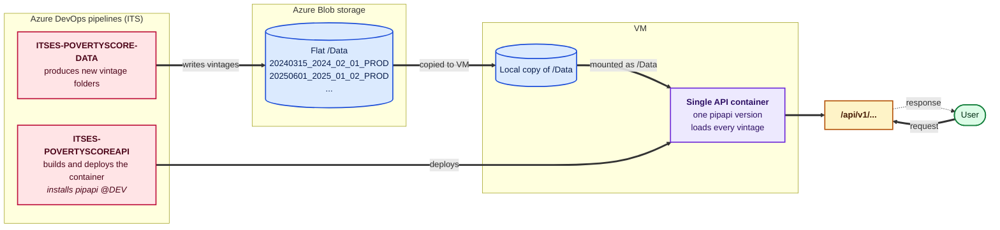
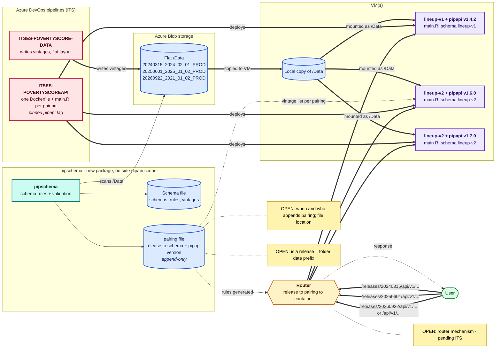

<!-- Valid status values: decided, in-progress, abandoned -->

# PIP API Code-Data Versioning: Post-ITS Revision

## Context

This brainstorm revises the design set out in three earlier documents:

- `2026-08-28-pipapi-code-data-versioning-model.md`: schema contracts, code pinning and historical pairings
- `2026-09-03-pipapi-multi-version-api-routing.md`: path-based routing and shared vs. partitioned storage
- `2026-09-23-its-meeting-code-data-versioning-overview.md`: the meeting brief prepared for ITS

It takes in (1) decisions and clarifications from the ITS meeting and (2) revisions from the author and team made since then. Where this document conflicts with the earlier ones, **this document wins**. The earlier files are kept unchanged as history.

Each item below is tagged with its origin: **[ITS]** for an ITS meeting decision or clarification, **[TEAM]** for an author or team revision, **[OPEN]** for something still to be clarified.

## Glossary (revised, authoritative)

| Term | Meaning | Example |
|---|---|---|
| **Vintage folder** | One data snapshot folder in `/Data`. | `20260922_2021_01_02_PROD` |
| **PIP release** | A date that users choose to get a specific, reproducible code + data result. Working hypothesis: equal to the date prefix of vintage folder names **[OPEN]**. | `20260922` |
| **Schema** | The structural and computational shape of a vintage folder. Defined by rules kept in `{pipschema}`. | `lineup-v1`, `lineup-v2` |
| **`{pipapi}` version** | A git tag of the pipapi R package. | `v1.6.0` |
| **Pairing** | A (schema, `{pipapi}` version) combination. **The unit of deployment: one pairing = one Docker image + one container.** | `lineup-v2__v1.6.0` |
| **Schema file** | A single file at the top of `/Data`, produced by `{pipschema}`, listing every schema, the rules that identify it, and the vintage folders that belong to it. | `/Data/schemas/...` (exact name/location TBD) |
| **`pairing` file** | A single file, produced by `{pipschema}` in the deployment workflow, recording vintage → schema, schema → `{pipapi}` version, and release → pairing. | TBD |

## Cardinality rules (settled)

```
PIP release ──many:1──▶ pairing (schema, pipapi version) ──1:1──▶ Docker image ──1:1──▶ container
                              │
schema ──1:many──▶ vintage folders   (every vintage folder belongs to exactly ONE schema)
pipapi version ◀──many:many──▶ schema  (abstract capability; the deployment pins one version per pairing)
```

1. A `{pipapi}` version **can support multiple schemas** (e.g., the transition release v1.4.2). A schema **can be supported by many `{pipapi}` versions** over time. In the abstract this is many-to-many.
2. A **container is keyed by a pairing** (schema + `{pipapi}` version), not by schema alone **[TEAM]**. A new `{pipapi}` version deployed for an existing schema means a **new image and a new container**.
3. **Every vintage folder belongs to exactly one schema.** This is a hard requirement on `{pipschema}`: its schema rules must be mutually exclusive and must cover every folder. A folder that matches zero schemas or more than one must fail when the schema file is generated.
4. **Every PIP release maps to exactly one pairing.** Many releases can share a pairing. If a release is a date prefix, every folder with that prefix (all PPP years, PROD/INT/TEST) must belong to the same schema. This is a validation rule **[OPEN, tied to the release definition]**.
5. **Release → pairing bindings are append-only and frozen.** Once release `20250601` points to `lineup-v2__v1.6.0`, it never changes. This is what reproducibility rests on **[TEAM]**.
6. **Number of live containers = number of distinct pairings that at least one live release points to.** It goes up only when a `{pipapi}` upgrade that changes results is deployed for a schema, not with every release.

## Requirements

### Functional

- **Reproducibility is the top priority [TEAM].** Choosing a release must always return results from the same code + data pairing that served it when it was bound.
- **Release-based routing [TEAM].** The user chooses a PIP release. The router sends the request to the container of that release's pairing.
- **Unchanged parameters inside the container [TEAM].** The existing vintage parameters (`version`, `release_version`, `ppp_version`, `identity`) behave exactly as today *inside* a container. The release replaces only the routing step.
- **Backward compatibility.** `/api/v1/...` with no release still works and goes to the pairing of the latest release.
- **Per-container data scoping.** Each container builds lookups only for the vintage folders of the releases bound to its pairing (not every vintage in the schema, which would let two containers answer the same release differently).

### Non-functional

- **Flat `/Data` layout is kept [ITS].** No reorganization into schema sub-folders. The earlier "Option B (schema-partitioned storage)" is **dropped**.
- **Central schema metadata, not per-folder manifests [TEAM].** Efficiency: editing ~200+ folders one by one is impractical; one centrally maintained file is manageable.
- **Efficiency charter alignment.** Containers no longer scan and reject most of `/Data`. They load a list of names taken from the central metadata.
- **Clear ownership.** Your team owns `{pipapi}`, `{pipschema}`, the specification and the git tags. ITS owns the VMs, data copying, images, containers, router and pipelines.

## What changed relative to the earlier design

| Topic | Earlier design (08-28 / 09-03) | Revised design (this document) | Origin |
|---|---|---|---|
| Data path to container | Blob mounted (directly or as a share) at `/Data` | Blob → **copied to VM** → VM-local copy mounted into the container at `/Data` | [ITS] |
| Storage layout | Option A (flat + manifests) vs. Option B (schema partitions) | **Flat layout kept**. Option B dropped. | [ITS] |
| Schema metadata | `_manifest.yaml` inside **each** vintage folder | **One central schema file** at the top of `/Data`, produced by **`{pipschema}`** | [TEAM] |
| Schema detection logic | Inside `{pipapi}` (`use_new_lineup_version()` / manifest checks) | Moved **out of `{pipapi}`** into `{pipschema}` rules | [TEAM] |
| `pairings.yaml` | Release → schema; hand-maintained | **`pairing` file** produced by `{pipschema}`: vintage → schema, schema → `{pipapi}` version, release → pairing | [TEAM] |
| Container key | One per `{pipapi}` release tag | One per **pairing (schema + `{pipapi}` version)** | [ITS] + [TEAM] |
| Image build | One parameterized Dockerfile, `ARG PIPAPI_VERSION` | **One Dockerfile + one `main.R` per container** (pinned `{pipapi}` in the Dockerfile, schema/pairing declared in `main.R`) | [ITS] |
| `main.R` config | Env vars `PIPAPI_DATA_ROOT`, `PIPAPI_SCHEMA`, `PIPAPI_API_VERSION` | Pairing declared at the top of `main.R`. Versions read from the `pairing` file and passed to `create_versioned_lkups()` through `vintage_pattern` | [ITS] + [TEAM] |
| URL user-facing key | `/releases/{pipapi_tag}/api/v1/...` | `/releases/{PIP release date}/api/v1/...` (pending ITS confirmation) | [TEAM] |
| Router mapping | Static: tag → container | **Release → pairing → container**, rules generated from `pairing` | [TEAM], **[OPEN for ITS]** |

## Components (revised architecture)

### Data side
- **Azure Blob storage** stays the source of truth. The ITSES-POVERTYSCORE-DATA pipeline writes vintage folders there in the **existing flat layout**.
- **VMs:** ITS copies the data from Blob to each VM. The **VM-local copy** is what gets mounted into the containers as `/Data` **[ITS]**. (The exact copy mechanism, its frequency and whether every VM gets the full `/Data` are ITS details, still to be documented.)
- **Schema file:** a single file (or a single file in a new `schemas/` folder, **[OPEN]**) at the top of `/Data`. It lists every schema, the rules that identify it and its vintage folders.
- **`pairing` file:** location **[OPEN]**: next to the schema file in `/Data` (copied to VMs with the data) or in the deployment repo `ITSES-POVERTYSCOREAPI`. The router must be able to read it, or read rules generated from it.

### `{pipschema}` (new package, outside the current `{pipapi}` scope)
- **Role:** the single authority on "which vintage belongs to which schema" and "which release is served by which pairing".
- **Responsibilities:**
  1. Hold the **rules** that identify each schema (moved out of `{pipapi}`, where the date heuristic `use_new_lineup_version()` lives today).
  2. Scan `/Data` and generate the **schema file**: schemas, rules, vintage folders.
  3. **Validate:** each vintage matches exactly one schema; each release (date prefix) falls within one schema.
  4. Generate or append the **`pairing` file**: release → (schema, `{pipapi}` version). **Append-only**; existing bindings are never rewritten.
- **When it runs:** working hypothesis: at **data publication**, so a new release is bound to the `{pipapi}` version currently deployed for its schema **[OPEN: to be investigated and discussed]**.
- **Relationship to `{pipapi}`:** `{pipapi}` *consumes* the outputs (through `main.R`). It doesn't produce schema metadata and ideally doesn't depend on `{pipschema}` at runtime. `main.R` only reads the `pairing` file.
- **Relationship to deployment:** its outputs drive (a) which vintages each container loads and (b) the router rules.

### Code side (`{pipapi}`)
- `create_versioned_lkups(data_dir, vintage_pattern)` (`R/create_lkups.R:8`) stays the entry point. **No new argument:** `vintage_pattern` is already used as a regex (`grepl()` in `id_valid_dirs()`, `R/create_lkups.R:908`), so `main.R` builds an exact-match pattern from the list of versions (e.g., `^(v1|v2|...)$`, with version names regex-escaped).
- Once schema logic lives in `{pipschema}` and each container serves one pairing, future single-schema `{pipapi}` releases can drop `use_new_lineup_version()` and the old lineup code path (the cleanup payoff from the 08-28 brainstorm still applies).

### Deployment side (ITS)
- **One container per pairing**, each with **its own Dockerfile and `main.R`** **[ITS]**:
  - **Dockerfile:** installs a **pinned** `{pipapi}` version (git tag), never a floating branch.
  - **`main.R`:** declares the pairing (schema + `{pipapi}` version), reads the vintage list for that pairing from the `pairing` file, builds `vintage_pattern`, calls `create_versioned_lkups()` and starts the API. Sketch (structure only, to be detailed):
    ```r
    schema   <- "lineup-v2"
    pairing  <- read_pairing("/Data/<pairing-file>")          # TBD format/location
    versions <- pairing[[schema]]$versions                    # restricted to this pairing's releases
    pattern  <- paste0("^(", paste(escape_regex(versions), collapse = "|"), ")$")
    lkups    <- create_versioned_lkups("/Data", vintage_pattern = pattern)
    start_api("v1", 8080)
    ```
- **Container mount:** the VM-local copy of `/Data` (flat), one mount point per container (ITS preference).
- **Router:** see Decision. Rules are generated from `pairing`.

### User-facing side
- `/api/v1/<endpoint>?...` → pairing of the latest release (unchanged behaviour).
- `/releases/<release-date>/api/v1/<endpoint>?...` → pairing bound to that release. Vintage parameters inside it work as today.
- Unknown release → 404. Release whose pairing has been retired → 410 (lifecycle policy still to be defined).

## Approaches Considered

Scope of the alternatives: how the router maps a release to its container.

### Approach 1: Release in URL path, router rules generated from `pairing`
`/releases/20250601/api/v1/pip` → the rule built from `pairing` sends it to `lineup-v2__v1.6.0`. The prefix is removed before forwarding.
- **Pros:** standard path-prefix routing. URL caching works. No changes to `{pipapi}` routes. The router follows rules and holds no logic. Close to the spec ITS already saw.
- **Cons:** one rule per release (slow growth). Rules must be regenerated whenever `pairing` gets a new entry, which ties router config to the data publication workflow.
- **Effort:** Medium (mostly ITS, plus a rule-generation step).

### Approach 2: Release as query parameter (`?release=20250601`)
- **Pros:** looks like today's parameters.
- **Cons:** many standard reverse proxies route on path/host, not query. This may need a more capable gateway (to be checked with ITS). It mixes routing with the vintage parameters used inside containers, which was rejected in the 09-03 brainstorm.
- **Effort:** Medium–Large, depending on ITS tooling.

### Approach 3: Thin dispatcher service
A small service (or the "latest" container) reads `pairing` at runtime and forwards or redirects.
- **Pros:** no router rule changes when releases are added. Any URL shape works.
- **Cons:** an extra component and a possible single point of failure. Redirects are awkward for API clients. It puts routing logic in app code instead of infrastructure.
- **Effort:** Medium.

## Decision

1. **Container = pairing (schema + `{pipapi}` version)**, with one Dockerfile and one `main.R` per container **[ITS + TEAM]**.
2. **Flat `/Data` layout kept**. Data goes Blob → VM copy → container mount **[ITS]**.
3. **Per-folder `_manifest.yaml` dropped.** It is replaced by a **central schema file** and a **`pairing` file**, both produced by the new **`{pipschema}`** package **[TEAM]**.
4. **`{pipapi}` uses `create_versioned_lkups()` with `vintage_pattern`** built from the pairing's vintage list. No new argument **[TEAM]**.
5. **Release → pairing bindings are append-only and frozen** (reproducibility) **[TEAM]**.
6. **Routing: Approach 1** (release in the URL path, rules generated from `pairing`), **pending ITS confirmation** **[TEAM, OPEN for ITS]**.

**Rationale:** reproducibility is the top priority, and keying containers by pairing is what guarantees it. Central metadata is the only manageable option at ~200+ folders. Approach 1 is the simplest routing that fully answers the release → container question and reuses a pattern ITS already reviewed.

## Devil's Advocate Notes (recorded)

- **Problem validation:** pre-validated (explicit user requests, 09-03 brainstorm). Reproducibility confirmed as key.
- **Simplicity:** if the inventory shows only one pairing is live today, routing could be deferred until a second pairing exists. `{pipschema}`, `pairing` and pinned containers would ship first. Check this against the schema/release inventory.
- **Effort-value:** the main cost and risk is the **governance of `pairing`** (who appends, when, how it's frozen), not the router itself. Routing shouldn't be automated before that's settled.
- **Charter, efficiency:** improved over the earlier Option A. Containers load an explicit vintage list instead of scanning and rejecting.
- **Charter, tests:** no conflict. `{pipapi}` changes are small, and schema logic moves to `{pipschema}`.
- **New tension:** containers multiply with each result-changing `{pipapi}` upgrade, which makes lifecycle/retirement policy and ITS capacity planning necessary.

## Open Questions

### For ITS
1. **Router mechanism:** can the router map `/releases/<date>/...` to a pairing container, using rules generated from `pairing`? Who regenerates the rules, and when? (Approach 1 pending confirmation; Approaches 2/3 as alternatives.)
2. **VM copy step:** how is `/Data` copied from Blob to the VMs (tool, frequency, full vs. partial copy)? How does a new vintage reach running containers (restart? reload?)?
3. **Container placement:** how many VMs, how many containers per VM, and do all VMs carry the full `/Data`?
4. **Lifecycle:** retirement policy for pairings no longer referenced by any live release, and the HTTP response for retired releases (410 recommended).
5. **Build trigger:** with one Dockerfile per container, how are new images built and tagged (on git tag, manually, hybrid)?

### For the team / `{pipschema}`
6. **Release definition:** is a PIP release exactly the date prefix of vintage folder names (working hypothesis), or a separately curated label?
7. **Release-schema consistency:** confirm that all folders sharing a date prefix (PPP years, PROD/INT/TEST) always belong to one schema.
8. **Binding time and owner:** is release → pairing appended by `{pipschema}` at data publication (working hypothesis), or at API deployment? How does `{pipschema}` know the "current" `{pipapi}` version per schema?
9. **`pairing` file location:** in `/Data` next to the schema file, or in `ITSES-POVERTYSCOREAPI`?
10. **Schema file format and location:** a single file at the top of `/Data`, or a single file inside a new `/Data/schemas/` folder? Which format (YAML/JSON)?
11. **Schema rules:** how are rules expressed (date cutoffs, required files, column checks)? What triggers a new schema? (Carried over from 08-28.)
12. **When does a `{pipapi}` upgrade create a new pairing?** Only when results change for an existing schema, or on every release-relevant tag? Needs a written policy.
13. **In-place data corrections, cache behaviour, retention:** carried over unchanged from the 08-28 brainstorm.

## Architecture Diagrams (revised)

### Current architecture (corrected: VM copy step)



### Proposed architecture (revised)



*In the diagram, the `pairing` → container arrow is drawn only to the middle container for readability; every container reads its own vintage list. Example routing: `20240315` → lineup-v1/v1.4.2; `20250601` → lineup-v2/v1.6.0; `20260922` (latest) → lineup-v2/v1.7.0.*

## Next Steps

1. **Finish the schema × release × `{pipapi}` inventory** (the commitment from the ITS meeting), now framed as a draft `pairing` table: release → (schema, `{pipapi}` version). Flag transition releases and count the distinct pairings, which is the number of containers.
2. **Take the ITS open questions (1–5) to the next ITS meeting**, mainly router feasibility for Approach 1 and the VM copy mechanism.
3. **Settle the team open questions (6–12)**, mainly the release definition and the governance of `pairing` (binding time, owner, location).
4. **Start a separate brainstorm for `{pipschema}`** (scope, file formats, schema rules, validation, when it runs).
5. **Then `/cg-plan` for the `{pipapi}` side:** `main.R` pattern (pairing → `vintage_pattern`), regex escaping, tests, and the later single-schema cleanup.
