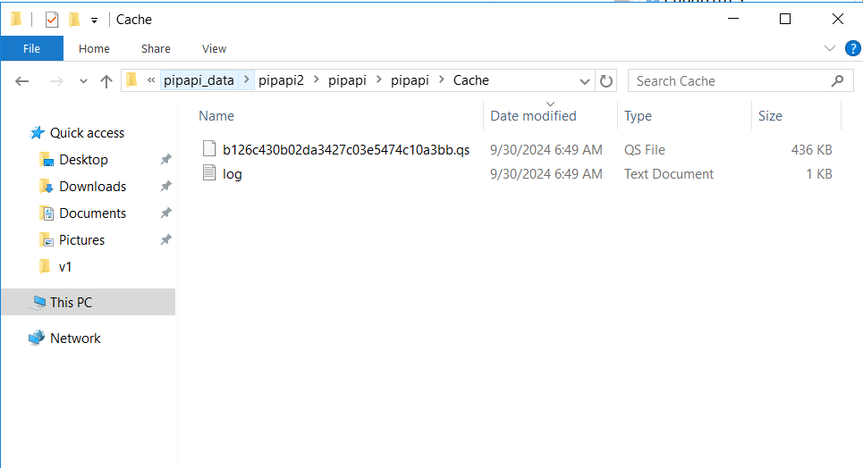

## How caching works?

In `pipapi` package in file `zzz.R` we have `.onLoad` function which looks like the following -

```{r, eval=FALSE}
.onLoad <- function(libname, pkgname) {
  if (Sys.getenv("PIPAPI_APPLY_CACHING") == "TRUE") {
    d <- rappdirs::user_cache_dir("pipapi")
    # log <- sprintf("%s/cache.log", d)
    cd <- cachem::cache_disk(d,
                             read_fn = qs::qread,
                             write_fn = qs::qsave,
                             extension = ".qs",
                             evict = "lru",
                             logfile = NULL,
                             max_size = as.numeric(Sys.getenv("PIPAPI_CACHE_MAX_SIZE")),
                             prune_rate = 50)
    pip <<- memoise::memoise(pip, cache = cd, omit_args = "lkup")
    ui_hp_stacked <<- memoise::memoise(ui_hp_stacked, cache = cd, omit_args = "lkup")
    pip_grp_logic <<- memoise::memoise(pip_grp_logic, cache = cd, omit_args = "lkup")
    ui_cp_charts <<- memoise::memoise(ui_cp_charts, cache = cd, omit_args = "lkup")
    ui_cp_download <<- memoise::memoise(ui_cp_download, cache = cd, omit_args = "lkup")
    ui_cp_key_indicators <<- memoise::memoise(ui_cp_key_indicators, cache = cd, omit_args = "lkup")
    assign("cd", cd, envir = .GlobalEnv)
    packageStartupMessage("Info: Disk based caching is enabled.")
  }
}
```

What this means is that if this environment variable is set `Sys.getenv("PIPAPI_APPLY_CACHING")` we create a caching file which saves the result on our disk. This disk is your local computer if you are working locally or server if the package is deployed there. This caching file is generated at location `d` i.e `rappdirs::user_cache_dir("pipapi")` in this case however, you can change it to any local folder while debugging. Rest of the lines include the functions that we are caching like `pip`, `ui_hp_stacked`, `pip_grp_logic` and so on.

So how this works is that we let's say call any function which is cached, for example - `pip`.

```{r, eval=FALSE}
pip(country = "CHN", year = 2017, lkup = lkup)
```

Now a file is created at the cache location which has it's output and looks like this.



This is the file whose name is hashed based on the arguments passed to the cached function (`pip`) and the log file has all the logs of caching operation.

Now if a new call is made like :

```{r, eval=FALSE}
pip(country = "all", year = "all", lkup = lkup)
```

then a 2nd file is generated whereas the log file is updated.

If you call the 1st `pip` call again :

```{r, eval=FALSE}
pip(country = "CHN", year = 2017, lkup = lkup)
```

then this time it will use the cached result and give the output instantly. No processing is done at all in this. No new file is generated this time around but the log file is updated.

## Debugging caching

In `pip-precaching-script` repository, I have created a branch called `debug-ronak` and in this branch if you look at the file `main.R` you will see the exact script that I used to debug the API. Note that there are two levels where we need to check caching or any general PIP issue. One is when you are using `pip` directly as a function like how we showed above like `pip(country = "all", year = "all", lkup = lkup)` and another one is via the API like how it is shown in `main.R` file. Also note that I am using `pip` function as a general example here. This is true for all the functions in `pipapi` package. The API calls the functions from `pipapi` package so the basic code is the same across both the levels. However, API has some additional layers on top of these functions which might make them different.

The recent case of caching not working only for country = "all" and year = "all" was visible via API, however when we used the `pip` call directly caching was working perfectly fine. So in this case it was something in the API that was causing the trouble. It is very rare but it does happen every now and then. And just to conclude the topic the issue was that for intensive calculation like country = "all" and year = "all" we were using `promises::future_promise` function for asynchronous calling and we forgot to include `promises` package in the `DESCRIPTION` file of `pipapi` package so `promises` package was not available and it did not work when using country = "all" and year = "all".

Moreover, it is **very** important to kill the API you are launching if you are using the same port for debugging (`apis$kill()`). We are using `callr` to launch the API in new session so we can't actually "see" that a session has been launched so it is important to understand about this. For example, if we launch the API on port 8080 with `callr`, the session is busy in the background. In the current session that we have access to is working normal and we can execute our code. If we do some changes and run the same code to launch the API it would not reflect the changes because the background session is still busy with the previous code and has not been killed yet. In such scenario we have couple of options : 

1. Use new port number to run code in different session
2. Kill the previous session and launch the API again to see the changes

Step 2 is what `apis$kill()` is doing. 

All the best!
